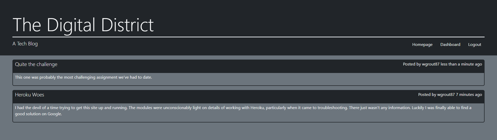
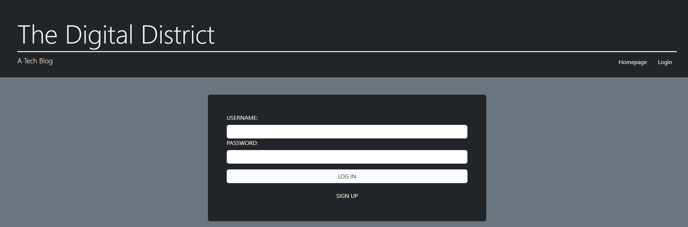
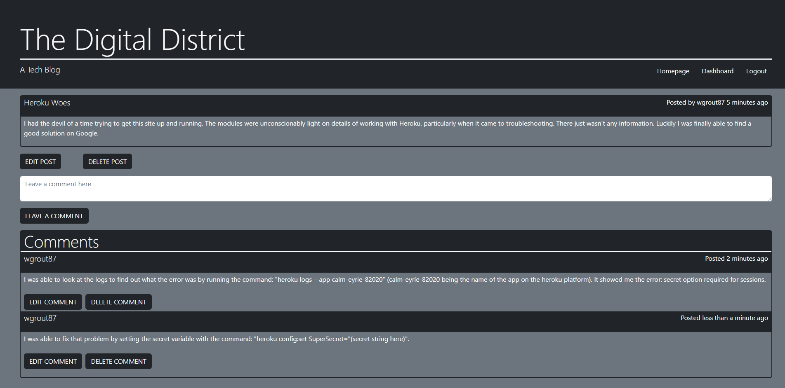

# Digital District

## Description

The Digital District is a CMS style blog allowing users to log in to an account in order to create posts, comment on posts, and edit or delete previous comments or posts. Upon loading the application, the user is presented with any existing posts, and has the option to view those posts, or after logging in, comment on and create posts.

## Links

[Code repository](https://github.com/wgrout87/Digital-District)
[Deployed application](https://calm-eyrie-82020.herokuapp.com/)

## Table of Contents

- [Installation](#installation)
- [Usage](#usage)
- [License](#license)
- [Contributing](#contributing)
- [Tests](#tests)
- [Questions](#questions)

## Installation

The project has been deployed to Heroku, and can be visited at [https://calm-eyrie-82020.herokuapp.com/](https://calm-eyrie-82020.herokuapp.com/). To run the app locally, first run the command "npm i" to install the app's dependencies. Next open up a MYSQL terminal and run a SOURCE command to establish the database from the schema.sql file located in the db folder in the project's base directory. At that point, it should be good to go and can be started with the command "npm start". Your own instance of a Heroku deployment could also be achieved by running the commands "heroku create", "git push heroku main", and "heroku config:set SuperSecret="your secret phrase here"". The last command establish the secret variable that is necessary for running sessions. At that point the app should be fully up and running.

## Usage

The Digital District is an app for creating and commenting on blog posts. The homepage displays all of the post activity, with the most recently updated posts at the top of the list. Users can see all blog posts from the homepage, but they can also click on individual blog posts to see them on a page by themselves and interact with the posts through comments. On the individual post pages, all comments will be displayed, and the user will have the option to update or delete the post if they were the original creator, as well as any comments they may have made. While logged in, the user also has the ability to access their dashboard, which displays all of the posts they have created. While logged out, access to many of the app's functionality is limited, but the user can still view posts and comments.

## License

Copyright 2022 William Grout

Permission is hereby granted, free of charge, to any person obtaining a copy of this software and associated documentation files (the "Software"), to deal in the Software without restriction, including without limitation the rights to use, copy, modify, merge, publish, distribute, sublicense, and/or sell copies of the Software, and to permit persons to whom the Software is furnished to do so, subject to the following conditions:

The above copyright notice and this permission notice shall be included in all copies or substantial portions of the Software.

THE SOFTWARE IS PROVIDED "AS IS", WITHOUT WARRANTY OF ANY KIND, EXPRESS OR IMPLIED, INCLUDING BUT NOT LIMITED TO THE WARRANTIES OF MERCHANTABILITY, FITNESS FOR A PARTICULAR PURPOSE AND NONINFRINGEMENT. IN NO EVENT SHALL THE AUTHORS OR COPYRIGHT HOLDERS BE LIABLE FOR ANY CLAIM, DAMAGES OR OTHER LIABILITY, WHETHER IN AN ACTION OF CONTRACT, TORT OR OTHERWISE, ARISING FROM, OUT OF OR IN CONNECTION WITH THE SOFTWARE OR THE USE OR OTHER DEALINGS IN THE SOFTWARE.

[https://opensource.org/licenses/MIT](https://opensource.org/licenses/MIT)

## Contributing

Any contributions to this open source project on GitHub are welcome. The standard fork and pull workflow that Git enables is the best way to contribute.

## Tests

No tests have been created for this application.

## Questions

My GitHub Profile: [https://github.com/wgrout87](https://github.com/wgrout87)

wgrout87@gmail.com

Please feel free to email me with questions. Mention the Digital District in the subject line.
